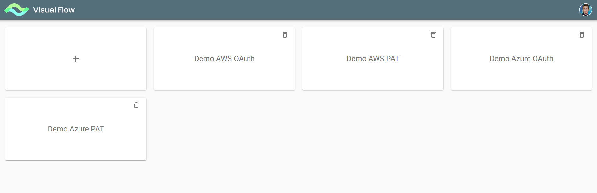
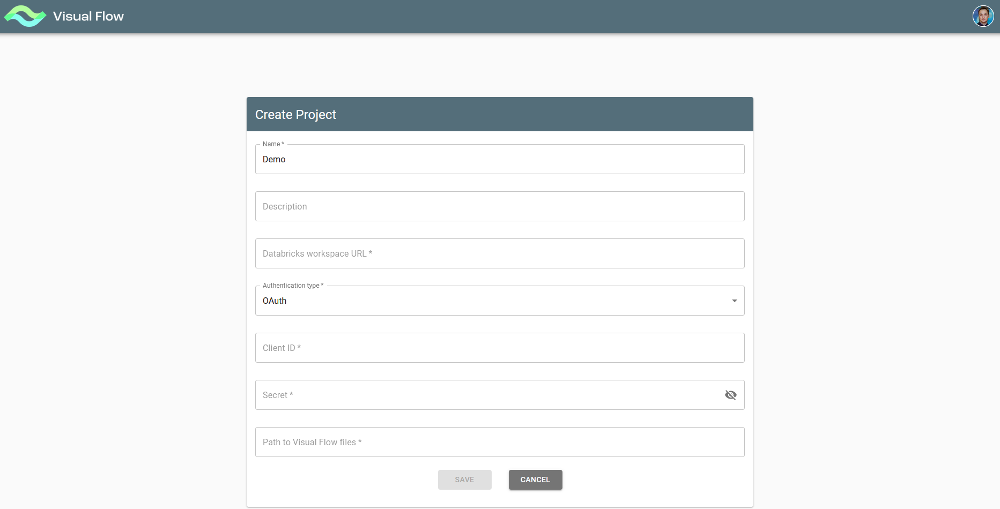
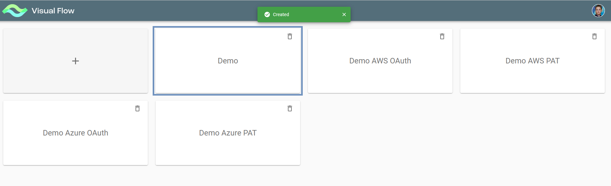

# Create a Project (Databricks version)

To create a project, you need to push the “+” button.

**Note**: this is the action of the Super-admin user only. The button is not visible for users with other roles (or having no role).

With the “+” button pushed, you get to Create Project Form to enter basic project settings:

* Project Name
* Project Description
* Databricks workspace URL
* Authentication type
* Client ID
* Secret
* Personal access token
* Path to Visual Flow files

**Note:**
* “Client ID” and “Secret” fields correspond to “OAuth” authentication type only
* “Personal access token” field corresponds to “Personal Access Token” authentication type only

  

After saving Create Project Form the project is created under the given name and then can be found on the initial
screen:

