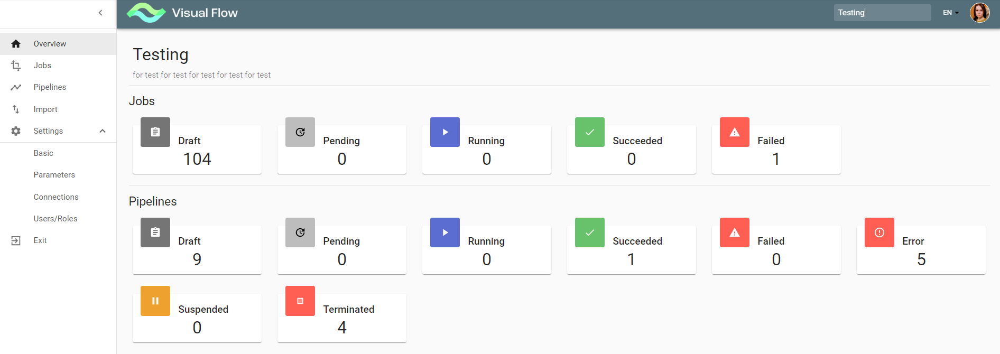
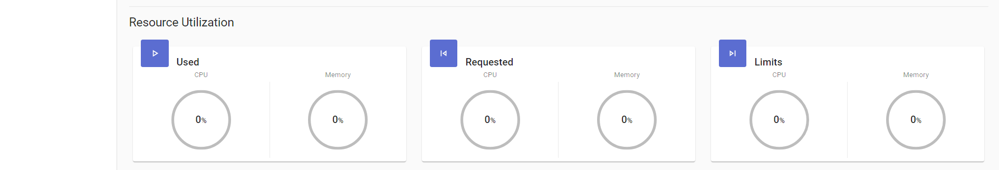

# Project Overview

The screen contains the project left menu and displays information about the project jobs, pipelines and resource
utilization (applicable for running jobs).

**Note:** resource utilization is not supported in Visual Flow for Databricks 0.2.
